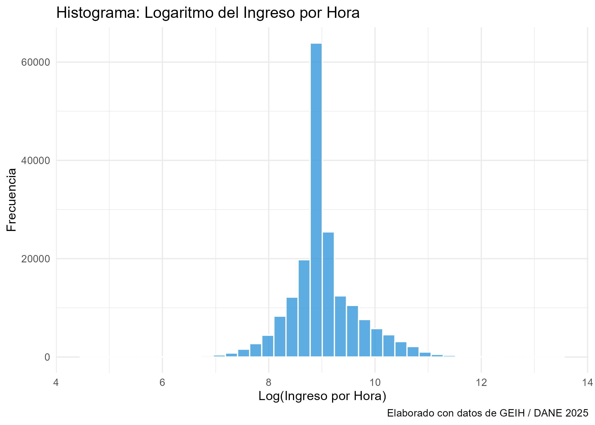
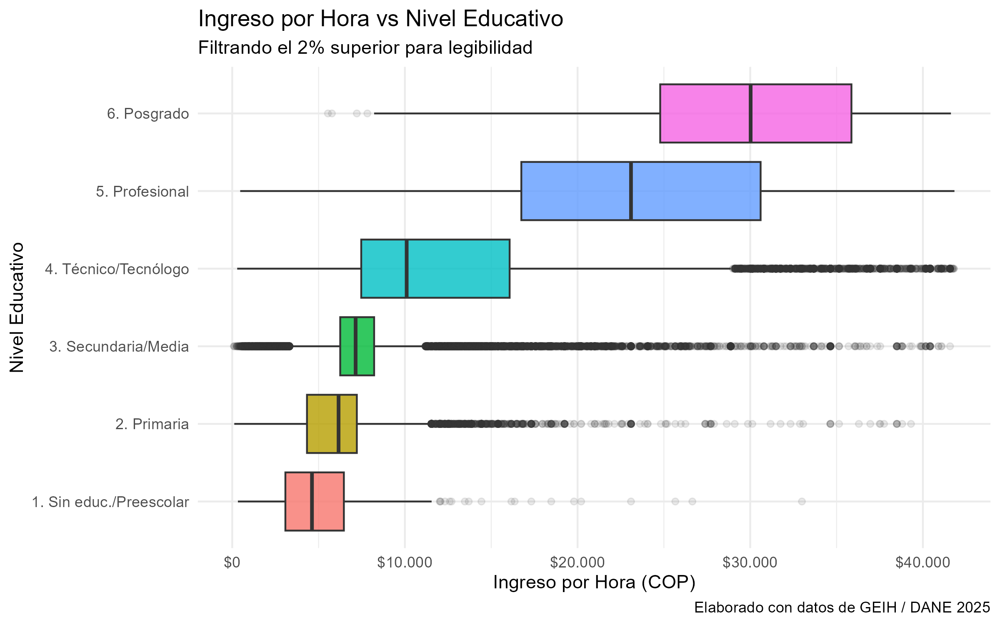
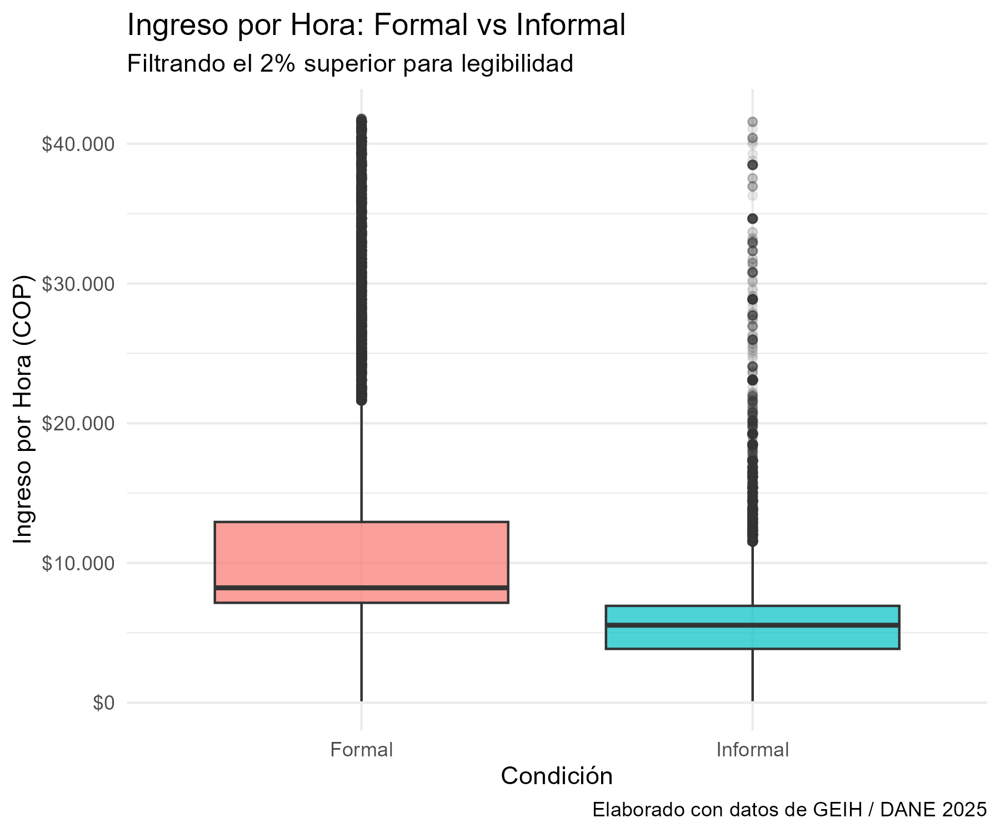
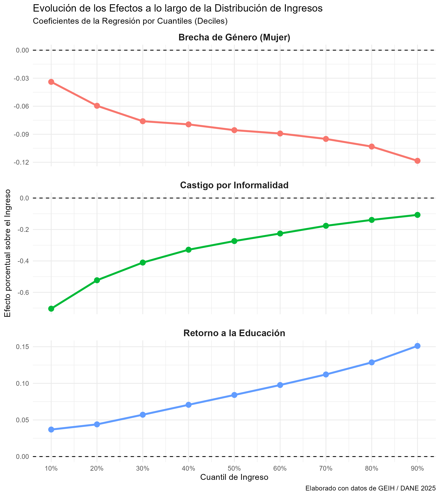
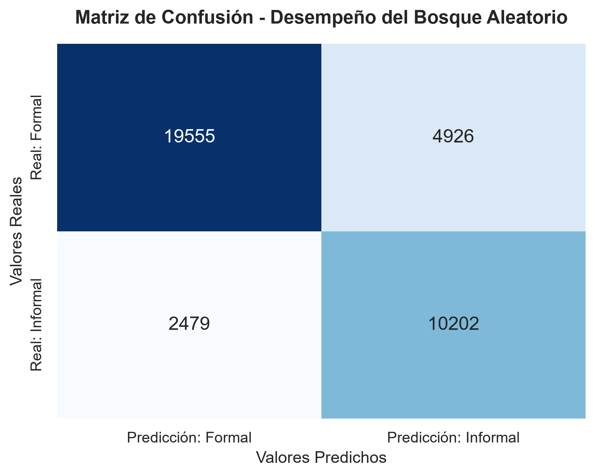
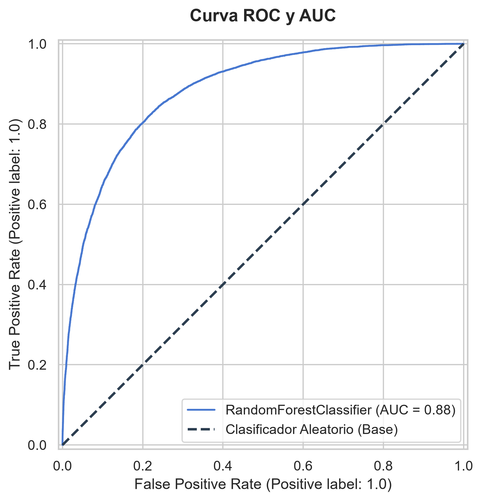

# Introducción

**Nota aclaratoria:** *El presente informe no se presenta de forma enteramente exhaustiva debido a la escasez temporal ocasionada por mi participación en el Simposio de Estadística Internacional con el profesor Jacobo Campo. No obstante, se ha procurado mantener el mayor rigor analítico posible, consolidando un documento que cumpla a cabalidad con los estándares exigidos para la convocatoria de derecho laboral.*

Este documento presenta una investigación sobre dos de los fenómenos más persistentes del mercado laboral en Colombia: la desigualdad salarial y la informalidad laboral. Utilizando los microdatos de la Gran Encuesta Integrada de Hogares (GEIH) del DANE, se combinan técnicas econométricas tradicionales, específicamente la Ecuación de Salarios de Mincer [@mincer1974], con algoritmos modernos de Aprendizaje Automático (*Machine Learning*), en particular Bosques Aleatorios (*Random Forest*). El objetivo es estimar cómo el castigo por informalidad y las brechas de género evolucionan a lo largo de toda la distribución de ingresos, y predecir con alta precisión la probabilidad de que un trabajador pertenezca al sector informal en función de sus características sociodemográficas.

# Datos

## Fuente de información
Los datos utilizados en este estudio provienen de la Gran Encuesta Integrada de Hogares (GEIH) del DANE correspondiente al año 2025, la cual provee información detallada sobre las condiciones laborales y demográficas de la población ocupada en Colombia.

## Variables utilizadas
El análisis se concentra en las siguientes variables clave:

*   **Variable Dependiente:** `ingreso_hora` (calculado a partir de los ingresos mensuales reportados y las horas trabajadas). Para los modelos econométricos, se utilizó una transformación logarítmica (`log_ingreso`) típica de la ecuación de salarios de Mincer.
*   **Variables Predictoras:**
    *   `sexo`: Variable dicotómica que permite evaluar la brecha de género.
    *   `edad` y su término al cuadrado `I(edad^2)`: Para capturar la relación cóncava clásica de la experiencia potencial sobre el ingreso.
    *   `nivel_educativo`: Variable para evaluar los retornos a la educación.
    *   `Tiempo_empresa`: Antigüedad o tenencia en el empleo actual.
    *   `rama_actividad`: Sector macroeconómico agrupado.
    *   `informal`: Variable dicotómica construida a partir del pago de seguridad social (salud y pensión).

## Limpieza de datos
Para garantizar la robustez matemática del análisis, el proceso de limpieza consistió en diversos pasos fundamentales. Primero, se realizó un trabajo arduo de ingeniería de características (*feature engineering*) para construir la variable de `informalidad`; esto implicó cruzar múltiples módulos y preguntas de la encuesta original para determinar con exactitud si el trabajador cotizaba a salud y pensión, transformando un complejo abanico de respuestas cualitativas en una única variable binaria estructurada. Segundo, se filtraron valores atípicos e inconsistentes, tales como ingresos reportados iguales a cero. Tercero, la variable de la rama de actividad, que originalmente contenía más de 80 rubros, fue agrupada en 14 grandes sectores macroeconómicos; un paso vital para evitar la singularidad de las matrices durante las estimaciones econométricas. Finalmente, se excluyeron aquellos registros con datos perdidos (`NaN`) críticos, garantizando un conjunto de datos apto para el entrenamiento del algoritmo predictivo.

# Estadísticas descriptivas

A continuación, se presenta un análisis exploratorio de las principales dinámicas del mercado laboral colombiano.

## Distribución del ingreso

{width=75% fig-align="center"}

El histograma muestra la distribución del logaritmo del ingreso por hora. Gracias a esta transformación logarítmica, la distribución asimétrica original se aproxima a una distribución normal. Sin embargo, se observa un pico pronunciado (leptocurtosis) en el centro exacto de la distribución, el cual corresponde a la aglomeración masiva de trabajadores que ganan exactamente el salario mínimo legal vigente, un fenómeno estructural que define la base salarial de Colombia.

## Educación e ingresos

{width=75% fig-align="center"}

## Formalidad laboral

{width=75% fig-align="center"}

# Metodología

Para estudiar la relación entre las características individuales y el salario, este documento emplea un enfoque metodológico mixto:

## Regresión Cuantílica
Se utilizó un modelo de Regresión por Cuantiles [@koenker1978]. A diferencia de los modelos OLS (Mínimos Cuadrados Ordinarios) que estiman la media condicional del ingreso, la regresión cuantílica permite analizar cómo las variables afectan al salario en diferentes puntos de la distribución (ej. el decil 10 de menores ingresos vs. el decil 90 de mayores ingresos). Debido a la existencia del "efecto salario mínimo" (aglomeración o *bunching* de ingresos en la mediana) en Colombia, se aplicaron errores estándar calculados por remuestreo (*Bootstrap*) para evitar la singularidad de la matriz.

## Random Forest (Machine Learning)
Para complementar el análisis econométrico y evaluar la predictibilidad del mercado laboral, se entrenó un algoritmo de clasificación no paramétrico (*Random Forest* o Bosques Aleatorios). El objetivo de este modelo es predecir si un trabajador pertenece al sector informal (1) o formal (0) utilizando únicamente sus características sociodemográficas. Se realizó un *tuning* manual de hiperparámetros (profundidad máxima, mínimo de muestras por hoja y métrica Gini) para prevenir el sobreajuste (*overfitting*).

# Resultados

## Modelos de Regresión Cuantílica (Ecuación de Mincer)

Al estimar los modelos para los deciles del 10% al 90%, se revelaron dinámicas asimétricas a lo largo de la distribución del ingreso:

{width=85% fig-align="center"}

### Brecha de género (El Techo de Cristal)
Los resultados muestran que la penalización salarial por ser mujer (línea roja) es estadísticamente significativa en toda la distribución, pero se agrava fuertemente a medida que incrementan los ingresos. Mientras que en el decil más pobre la penalidad es de aproximadamente 3.8% ($\beta = -0.0385$, p-value < 0.001), en el 10% más rico (cuantil 0.9) la brecha asciende a un 11.9% ($\beta = -0.1195$, p-value < 0.001). Esto es evidencia directa de un marcado "Techo de Cristal".

### Castigo por informalidad
El efecto de la informalidad (línea verde) es severamente recesivo en la base de la pirámide. Para el cuantil 0.1, el castigo salarial es de casi 69% ($\beta = -0.6904$, p-value < 0.001). Sin embargo, este castigo disminuye drásticamente a medida que subimos en la distribución, situándose en solo un 10% ($\beta = -0.1000$, p-value < 0.001) para el decil superior. Esto indica que la informalidad en altos ingresos obedece a una naturaleza diferente, asociada a menudo con el trabajo independiente altamente cualificado.

### Retornos a la educación
La educación (línea azul) exhibe rendimientos marginales estrictamente crecientes. Un nivel adicional de escolaridad aumenta el salario en apenas 3.6% en el decil 0.1 ($\beta = 0.0369$), frente a un contundente 15% de retorno marginal en el decil 0.9 ($\beta = 0.1502$).

## Predicción de informalidad (Machine Learning)

El modelo de clasificación *Random Forest* logró capturar exitosamente los patrones estructurales de la informalidad.

### Reporte de Clasificación y Matriz de Confusión

El modelo alcanzó una exactitud global (*Accuracy*) del 80%. Destaca su alto nivel de exhaustividad (*Recall*) del 80% para la clase informal; es decir, de todos los trabajadores informales reales, el modelo logra identificar correctamente a 8 de cada 10. Por otro lado, la precisión (*Precision*) para la clase formal es sumamente alta (89%), lo que indica que cuando el modelo cataloga a alguien como formal, casi siempre acierta. El *F1-Score* ponderado general es de 0.80, demostrando un excelente balance entre precisión y exhaustividad.

{width=65% fig-align="center"}

La matriz de confusión revela que el modelo tiene un desempeño muy robusto. Identificó correctamente a 19,555 trabajadores formales y a 10,202 trabajadores informales. Es de destacar que los Falsos Negativos (informales que el modelo no detectó y creyó formales) fueron apenas 2,479 casos. Esto evidencia que el modelo ha internalizado eficientemente los perfiles sociodemográficos que arrastran a la informalidad y rara vez deja que un caso informal pase inadvertido.

### Curva ROC y AUC

{width=65% fig-align="center"}

El área bajo la curva (AUC) de este modelo fue de **0.88**. Esto confirma de forma absoluta que el modelo tiene una excelente capacidad predictiva para clasificar la formalidad laboral, superando holgadamente la línea de un clasificador aleatorio (0.5) y consolidándose como una herramienta estadística muy potente.

# Conclusiones

Los hallazgos de este estudio demuestran estadísticamente que el mercado laboral colombiano es estructuralmente heterogéneo e inequitativo. En primer lugar, la informalidad actúa como una trampa de pobreza severa en la base de la pirámide (suponiendo castigos salariales de hasta el 69%), mientras que se diluye en los quintiles más altos. En segundo lugar, existe una barrera sistémica de "techo de cristal" para las mujeres, quienes sufren una penalización salarial que se triplica al escalar hacia los cargos de mayores ingresos. Finalmente, aunque la educación superior mantiene rendimientos marginales positivos, estos benefician desproporcionadamente a los deciles más ricos, perpetuando las desigualdades. Por su parte, la alta eficacia predictiva del algoritmo *Random Forest* (AUC de 0.88) concluye que caer en la informalidad no es un evento aleatorio de la economía, sino un resultado estructural que puede ser anticipado y perfilado casi en su totalidad a partir del nivel educativo, el sexo y la rama de actividad del individuo.

# Referencias

::: {#refs}
:::